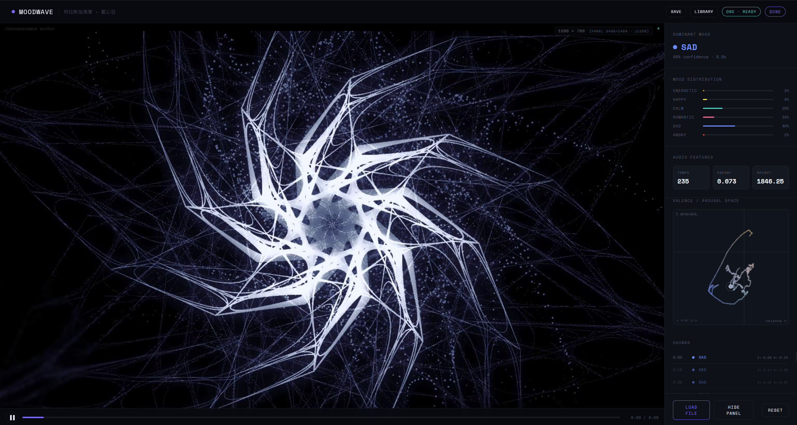
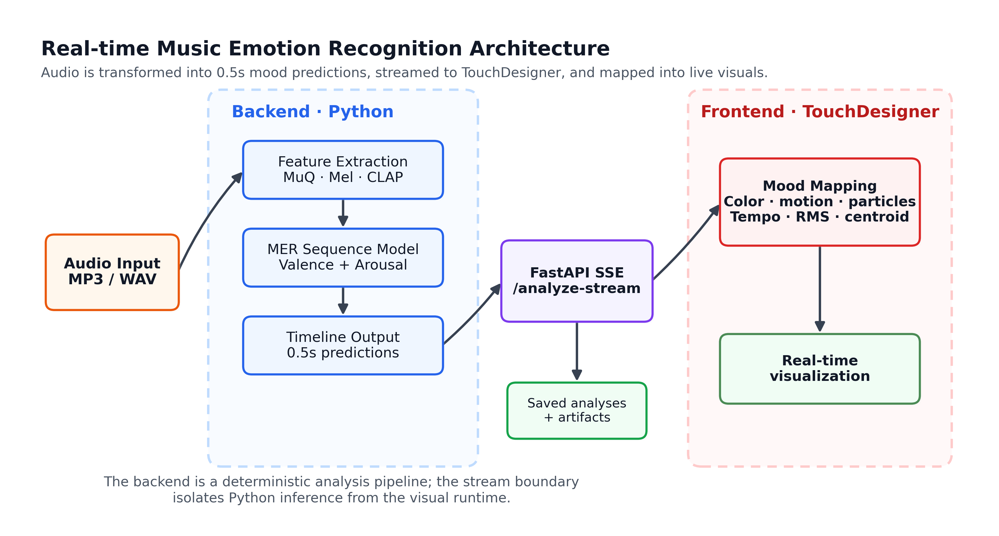
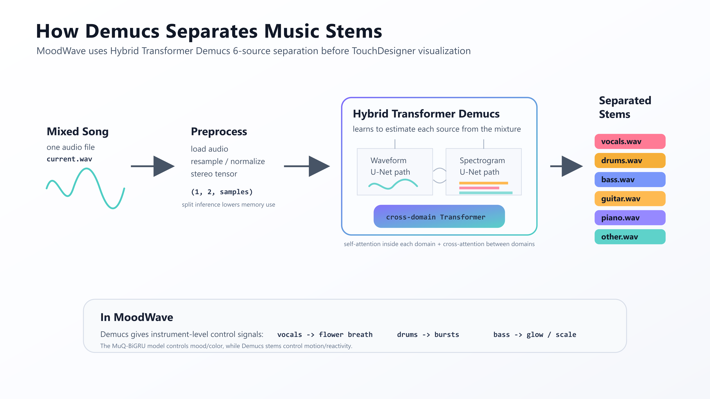

# MoodWave

MoodWave is a music emotion recognition and audio-reactive visualization system. A user uploads a song in the browser, the backend predicts a 0.5 second valence-arousal mood timeline with MuQ-BiGRU, Demucs separates the song into six stems, and TouchDesigner turns the mood timeline and stems into a live flower-and-particle visualization.



## Overview

MoodWave connects three runtime layers:

- **Backend:** FastAPI, MuQ-BiGRU inference, Demucs stem separation, saved-analysis storage.
- **Frontend:** upload UI, progress display, playback controls, mood dashboard, saved song library, TouchDesigner preview.
- **TouchDesigner:** OSC-controlled audio playback, timeline lookup, stem-reactive CHOP controls, final render streamed back to the browser.



## Main Features

- Dynamic music emotion recognition every `0.5s`.
- Valence-arousal prediction with a trained MuQ-BiGRU model.
- Six mood probabilities: `energetic`, `happy`, `calm`, `romantic`, `sad`, `angry`.
- Demucs `htdemucs_6s` source separation into:
  - `vocals`
  - `drums`
  - `bass`
  - `guitar`
  - `piano`
  - `other`
- TouchDesigner OSC integration for live visual control.
- Browser preview of the TouchDesigner render through MJPEG.
- Saved-analysis library so separated stems and analysis results can be reused.
- One-command Windows launcher for the demo pipeline.



## Repository Structure

```text
.
├── backend/
│   ├── main.py                 # FastAPI app and inference endpoints
│   ├── train.py                # Unified training/evaluation entry point
│   ├── core/                   # Models, utilities, Demucs separation
│   ├── features/               # MuQ, OpenL3, CLAP, Mel/MFCC extraction
│   ├── training/               # Training loop, metrics, LSO utilities
│   └── models/
│       ├── weights/            # MuQ-BiGRU and baseline checkpoints
│       └── metrics/            # Reports and training curves
├── frontend/
│   └── moodwave.html           # Browser UI
├── touch_designer/
│   ├── Ghost_Flower.95.toe     # Final TouchDesigner project
│   ├── TD_SETUP.md             # TouchDesigner operator setup notes
│   ├── osc_bridge.py           # Browser WebSocket -> TouchDesigner OSC bridge
│   └── td_mjpeg_server.py      # TouchDesigner TOP -> browser MJPEG stream
├── assets/                     # Project results and figures
├── start_moodwave.ps1          # Windows launcher
└── start_moodwave.bat          # Double-click launcher wrapper
```

Runtime uploads and saved songs are written to:

```text
backend/uploads/
backend/saved_analyses/
```

These folders are intentionally ignored by git.

## Requirements

Recommended environment:

- Windows 10/11
- Python 3.10
- TouchDesigner
- A working audio stack for `librosa`/`soundfile`
- CUDA-capable GPU recommended for MuQ and Demucs, but CPU can be used

The final demo expects these local ports:

| Service | Port | Purpose |
| --- | ---: | --- |
| FastAPI backend | `8000` | Serves frontend and analysis API |
| OSC bridge WebSocket | `7011` | Browser to bridge messages |
| TouchDesigner OSC | `7000` | Bridge to TouchDesigner OSC |
| TouchDesigner MJPEG | `9000` | Render preview in browser |

## Setup

Clone the repository and create a Python environment:

```powershell
git clone <your-repo-url>
cd <repo-folder>

conda create -n CS330_v2 python=3.10
conda activate CS330_v2

python -m pip install --upgrade pip
pip install -r backend/requirements.txt
```

If PyTorch is not installed correctly by the dependencies, install the PyTorch build that matches your machine from the official PyTorch selector, then rerun:

```powershell
pip install -r backend/requirements.txt
```

Make sure the final MuQ-BiGRU checkpoint exists:

```text
backend/models/weights/muq_bigru_strict.pth
```

## Quick Start

The easiest way to start the local demo on Windows is:

```powershell
.\start_moodwave.ps1
```

Or double-click:

```text
start_moodwave.bat
```

The launcher starts:

1. `touch_designer/osc_bridge.py`
2. FastAPI backend at `http://127.0.0.1:8000/`
3. Browser frontend

Then open the TouchDesigner project:

```text
touch_designer/Ghost_Flower.95.toe
```

In the browser, upload a song or load a saved analysis from the library.

## Manual Startup

If the launcher is not used, start each service manually.

Terminal 1 - OSC bridge:

```powershell
cd touch_designer
python osc_bridge.py
```

Terminal 2 - backend:

```powershell
cd backend
python -m uvicorn main:app --reload --port 8000
```

Then open:

```text
http://127.0.0.1:8000/
```

Finally, open:

```text
touch_designer/Ghost_Flower.95.toe
```

The TouchDesigner MJPEG health check should be available at:

```text
http://localhost:9000/health
```

## How The Runtime Pipeline Works

1. The browser uploads an audio file to `POST /analyze-stream`.
2. The backend converts it to a TouchDesigner-friendly `current.wav`.
3. Demucs separates six synchronized stems.
4. MuQ-BiGRU predicts a fine 0.5 second valence-arousal timeline.
5. The backend streams progress and results to the frontend using server-sent events.
6. The frontend sends one complete timeline payload to `osc_bridge.py` over WebSocket.
7. `osc_bridge.py` forwards timeline arrays, file paths, stems, seek, and transport commands to TouchDesigner over OSC.
8. TouchDesigner loads the main audio and stems, samples the current mood timeline, and renders the flower visualization.
9. `td_mjpeg_server.py` streams the final TouchDesigner TOP back to the browser.

## TouchDesigner Notes

The final project file is:

```text
touch_designer/Ghost_Flower.95.toe
```

The important TouchDesigner operator names are:

| Operator | Name |
| --- | --- |
| OSC In DAT | `oscin_ctrl` |
| OSC In CHOP | `oscin_timeline` |
| Main Audio File In CHOP | `audiofilein1` |
| Stem Audio File In CHOPs | `audiofilein_vocals`, `audiofilein_drums`, `audiofilein_bass`, `audiofilein_guitar`, `audiofilein_piano`, `audiofilein_other` |
| Timer CHOP | `playhead_timer` |
| Script CHOP | `current_mood` |

See [touch_designer/TD_SETUP.md](touch_designer/TD_SETUP.md) for the full TouchDesigner setup.

## Saved Analyses

After a song has been analyzed, the frontend can save:

- source filename
- main audio path
- 10 second UI chunks
- 0.5 second fine mood timeline
- average mood distribution
- V/A path snapshot
- Demucs stem paths

Saved analyses live under:

```text
backend/saved_analyses/
```

Loading a saved analysis sends the stored timeline and stems back to TouchDesigner without rerunning MuQ-BiGRU or Demucs.

## Training And Evaluation

The unified training entry point is:

```powershell
cd backend
python train.py --encoder muq --classifier bigru --split strict --epochs 80
```

Other examples:

```powershell
python train.py --encoder muq --classifier mlp --split strict
python train.py --encoder mel --classifier cnn-bigru --split strict
python train.py --encoder muq --classifier bigru --split strict --eval-only
```

Training outputs are stored in:

```text
backend/models/weights/
backend/models/metrics/
```

## Configuration

Optional environment variables:

| Variable | Example | Purpose |
| --- | --- | --- |
| `MOODWAVE_DEMUCS_DEVICE` | `cuda`, `cpu`, `auto` | Controls Demucs device selection |
| `MOODWAVE_VALENCE_GAIN` | `1.1` | Scales MuQ-BiGRU valence output for visualization calibration |
| `MOODWAVE_AROUSAL_GAIN` | `1.1` | Scales MuQ-BiGRU arousal output |
| `MOODWAVE_VALENCE_BIAS` | `0.05` | Shifts valence output |
| `MOODWAVE_AROUSAL_BIAS` | `-0.05` | Shifts arousal output |

Example:

```powershell
$env:MOODWAVE_DEMUCS_DEVICE = "cuda"
$env:MOODWAVE_VALENCE_GAIN = "1.0"
$env:MOODWAVE_AROUSAL_GAIN = "1.0"
```

## Troubleshooting

**Browser says OSC is disconnected**

Start the bridge:

```powershell
cd touch_designer
python osc_bridge.py
```

The bridge should show:

```text
WebSocket listening on ws://localhost:7011
OSC -> 127.0.0.1:7000
```

**TouchDesigner preview is offline**

Open `http://localhost:9000/health`. If it reports no frames, check that `td_mjpeg_server.py` is running in TouchDesigner and that its Frame Start callback calls:

```python
op('td_mjpeg_server').module.update_frame()
```

**Stem separation is slow**

Demucs can take a while, especially on CPU. Use a CUDA environment if available, or force CPU/GPU with `MOODWAVE_DEMUCS_DEVICE`.

**TouchDesigner cannot load an audio file**

Regenerate the analysis. The backend writes the main audio and stems as 44.1 kHz stereo PCM WAV files for TouchDesigner compatibility.

**The browser does not open automatically**

Open it manually:

```text
http://127.0.0.1:8000/
```

## Team Distribution

- Vincent: backend, model training, MuQ-BiGRU inference, API integration.
- Dhana: frontend, TouchDesigner visualization, OSC/MJPEG integration, demo pipeline.
